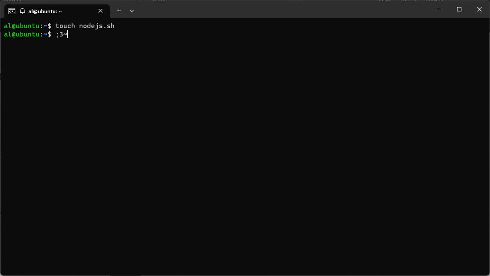
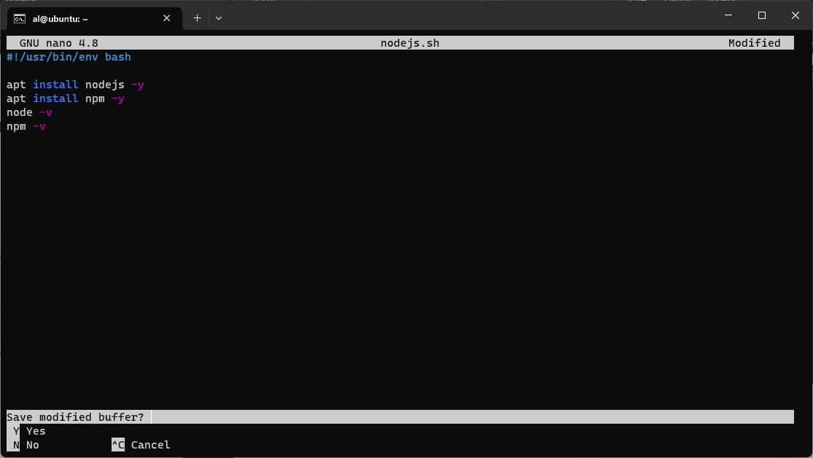
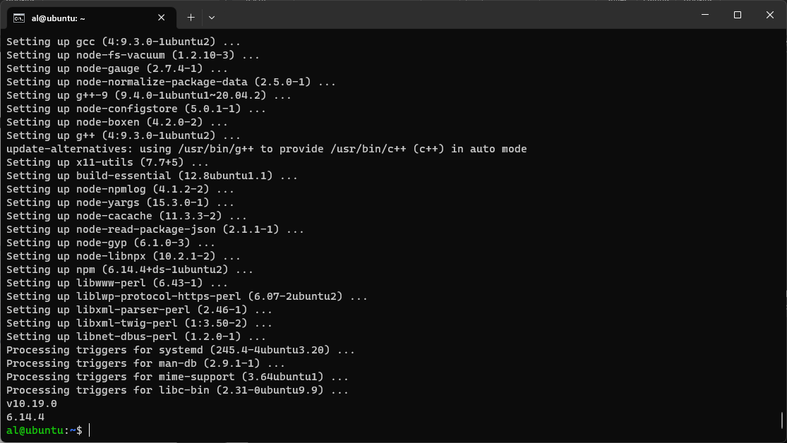

# Challenge - NodeJS BASH Script

## 1. Install nodeJS using BASH Script

1. buat file script nya terlebih dahulu
```bash
touch nodejs.sh 
``` 


2. Lalu copy script berikut
```bash
#!/usr/bin/env bash

apt install nodejs -y
apt install npm -y
node -v
npm -v
``` 


2. Jalankan script bash nya menggunakan super user
```bash
sudo sh nodejs.sh
```


[**Back**](../../README.md)
