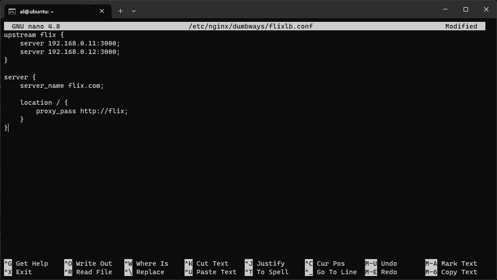
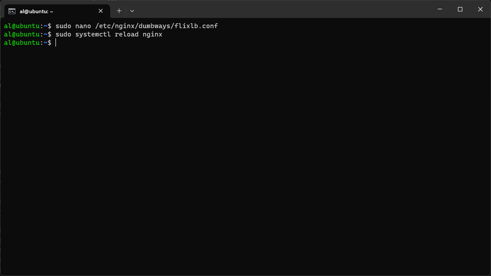
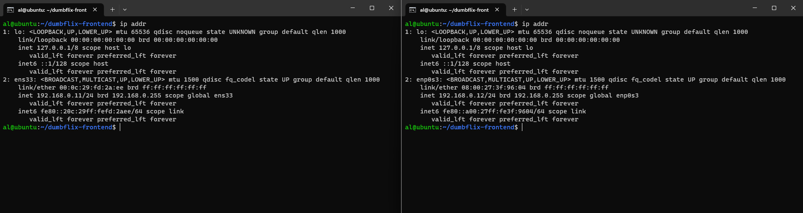
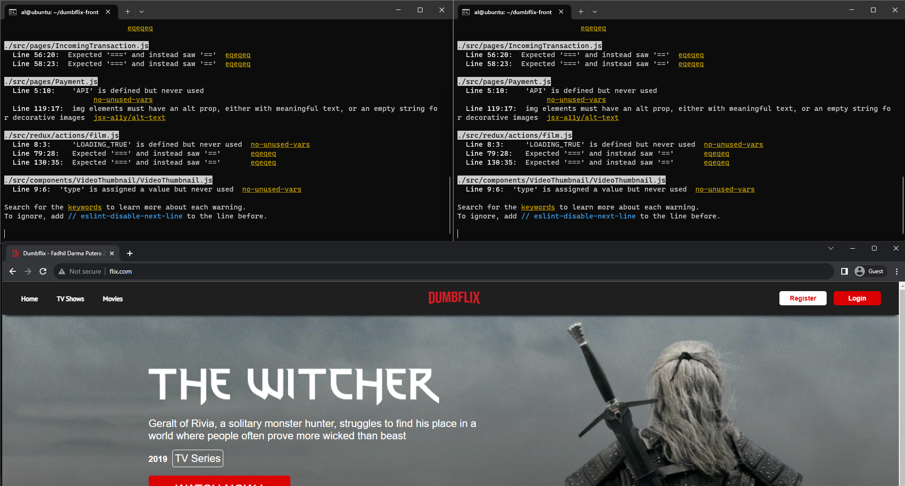

# Challenge - Load Balancing

## 1. Load Balancing nginx

1. Buat file .conf nya terlebih dahulu
```bash
sudo nano /etc/nginx/dumbways/flixlb.conf 
``` 

```bash
upstream flix {
    server 192.168.0.11:3000;
    server 192.168.0.12:3000;
}

server {
    server_name flix.com;

    location / {
        proxy_pass http://flix;
    }
}
``` 


2. Reload nginx
```bash
sudo systemctl reload nginx
``` 


3. Jalankan dumbflix di ke 2 server


4. Lalu cek websitenya


[**Back**](../../README.md)
