# Challenge - Localtunnel

## 1. Dumbflix-frontend via localtunnel (node)

1.	Clone repo dumb-flix
```bash
git clone https://github.com/dumbwaysdev/dumbflix-frontend.git
``` 
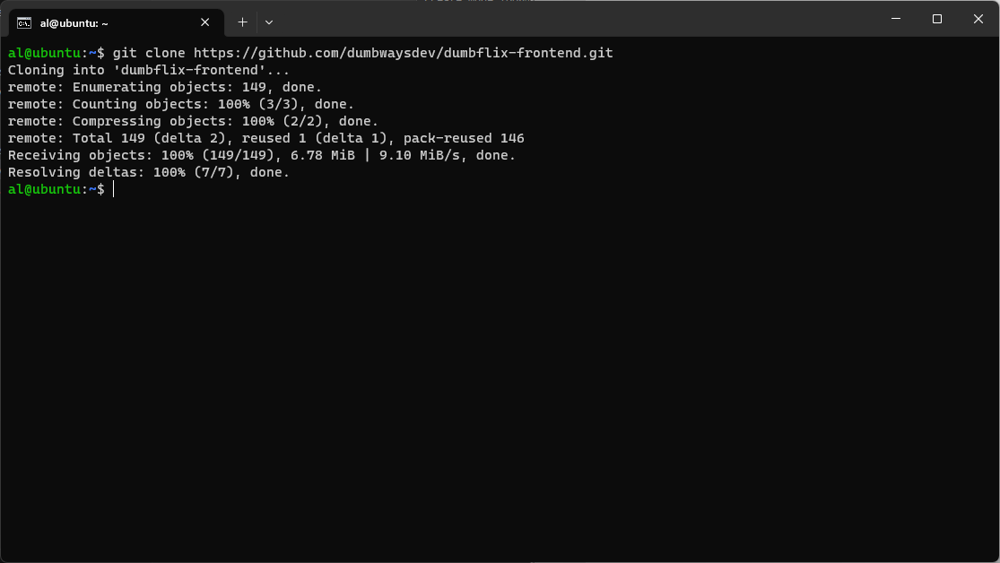

2.	Masuk ke folder dumbflix dan instal dependensi
```bash
cd dumbflix-frontend/
npm install
``` 
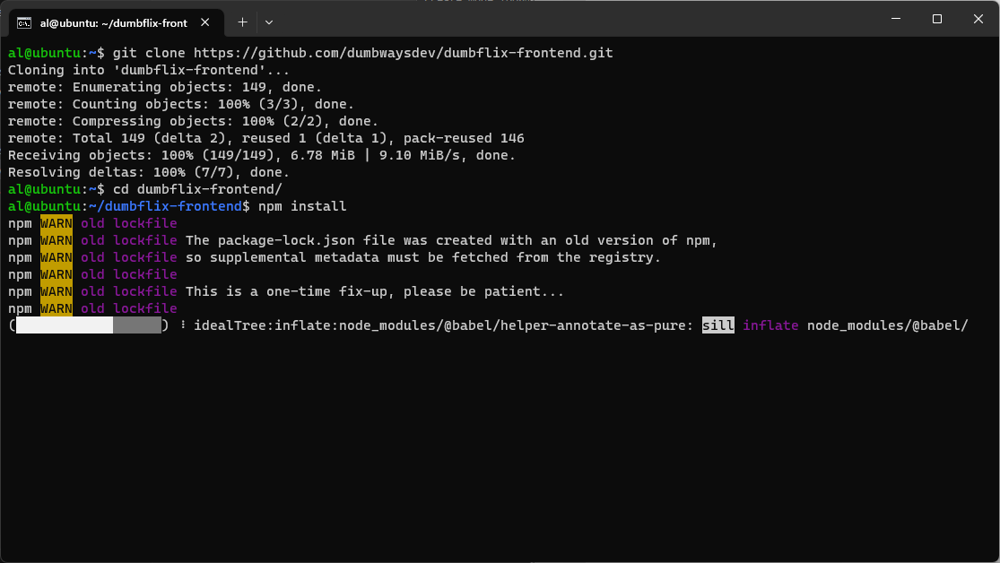
 
3.	Instal nvm 14
```bash
nvm install 14
``` 
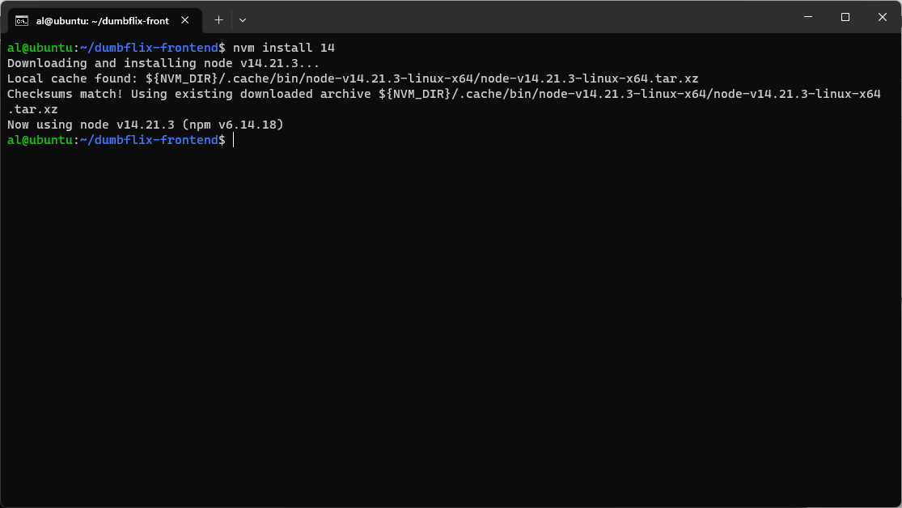
 
4.	Kemudian instal localtunnel
```bash
npm install -g localtunnel
``` 
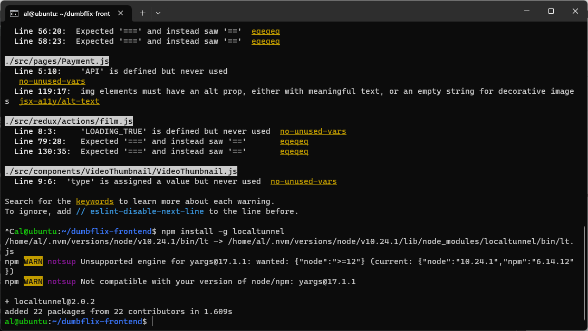
 
5.	Lalu jalankan aplikasinya 
```bash
npm start
``` 
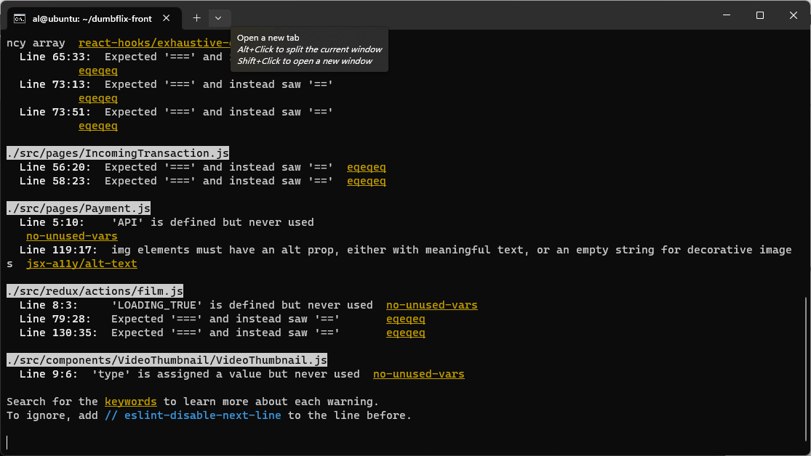
 
6.	Jalankan juga localtunnel nya
```bash
lt –-port 3000
``` 
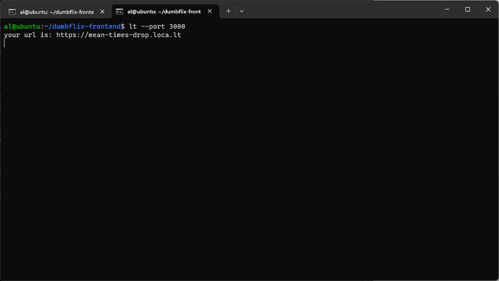
 
7.	Kemudian mencoba di browser
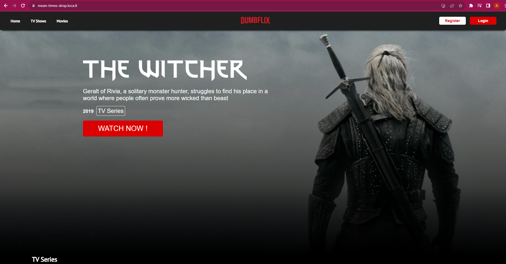
 

## 1. Python via localtunnel

1.	Masuk ke direktori python
```bash
cd python/ 
``` 
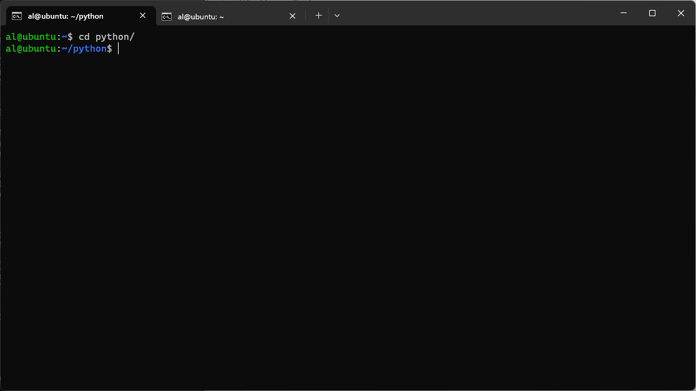

2.	Jalankan aplikasi python
```bash
python3 index.py
``` 
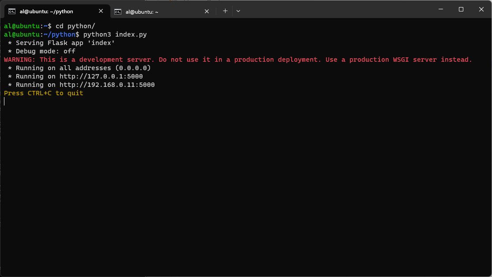
 
3.	Kemudian jalankan localtunnel dengan port 5000
```bash
lt --port 5000
``` 
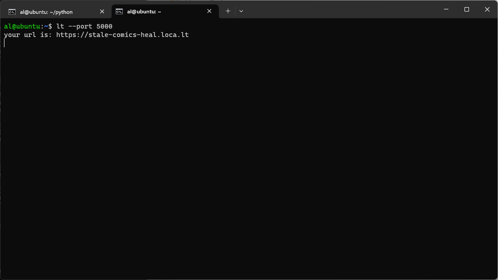
 
4.	Lalu buka menggunakan browser
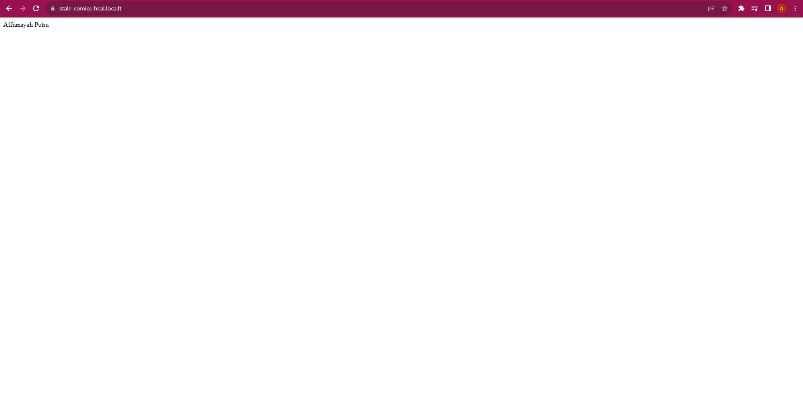
 
[**Back**](../../README.md)
