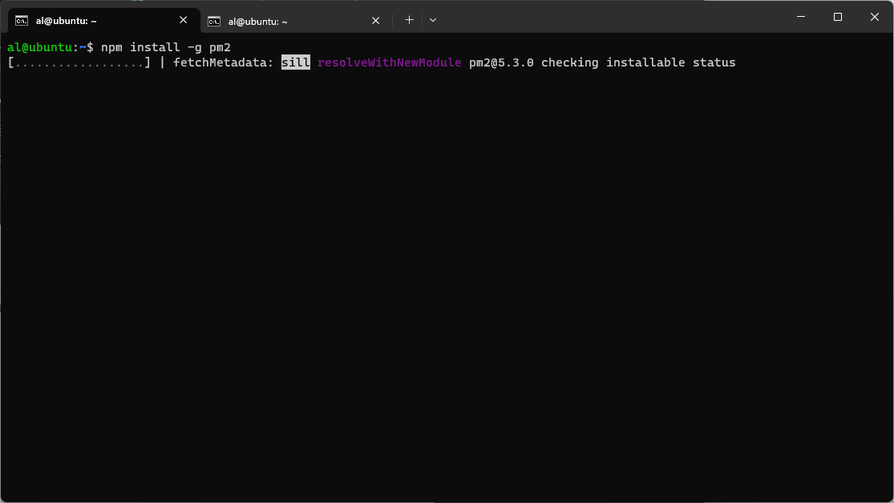
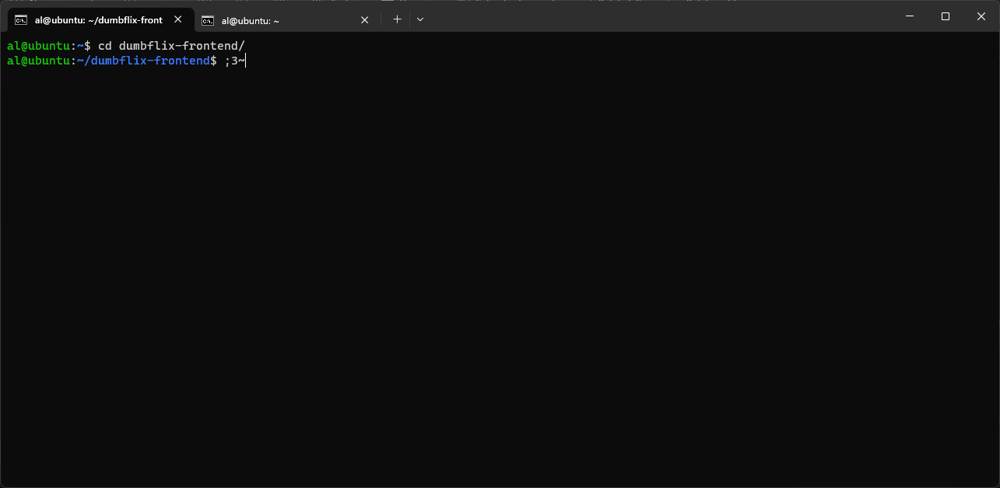
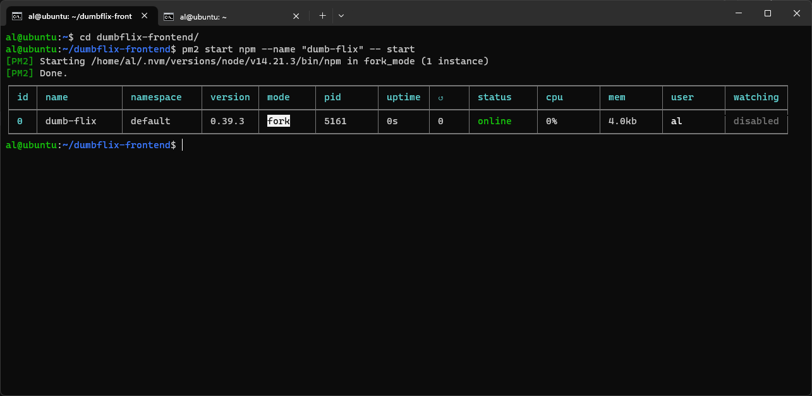
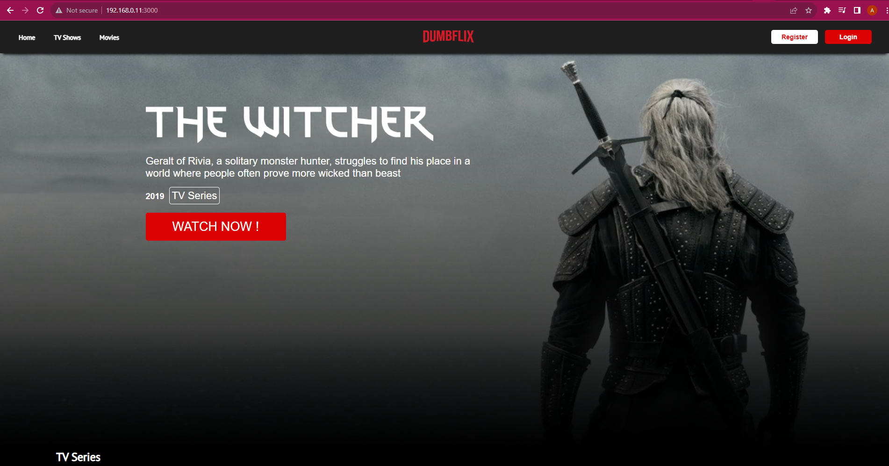
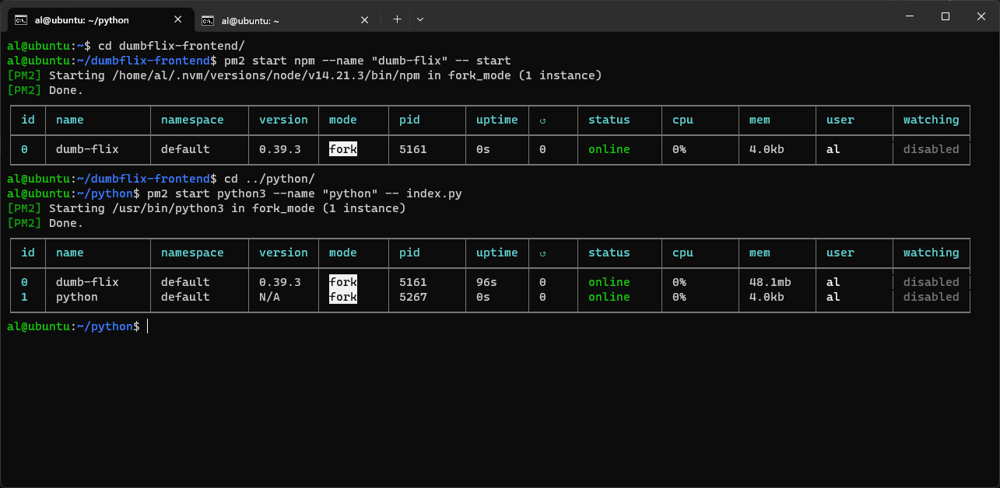
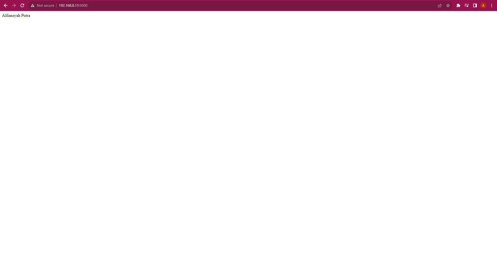

# Challenge - Process Manager [PM2]

## 1. Instalasi PM2 secara global kemudian run NodeJS & Python

1.	Install pm2 secara global
```bash
npm install -g pm2
``` 


2.	Masuk ke direktori dumb-flix
```bash
cd dumbflix-frontend/
``` 

 
3.	Kemudian menjalankan npm melalui pm2
```bash
pm2 start npm --name "dumb-flix" – start
``` 

 
4.	Mencoba di web browser

 
5.	Masuk ke direktori project python
```bash
cd ../python/
``` 

6.	Lalu jalankan python dari pm2
```bash
pm2 start python3 --name "python" -- index.py
``` 

 
7.	Mencoba di web browser


[**Back**](../../README.md)