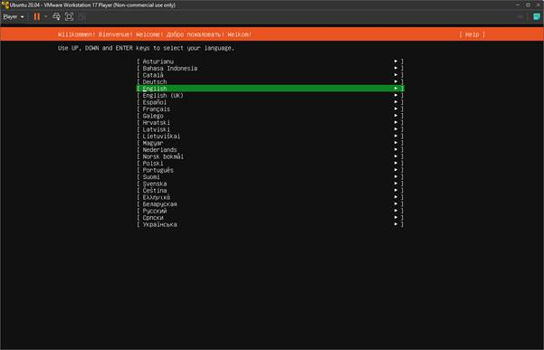
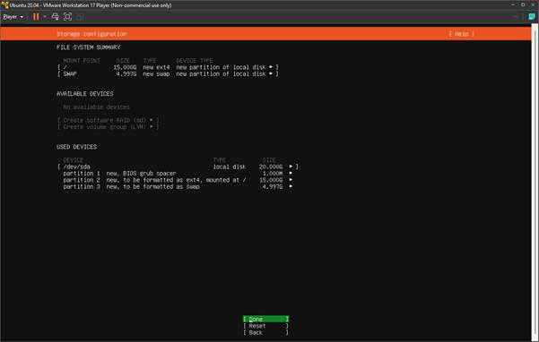

# Day 1 - Introduction to DevOps

## 1. Definisi

DevOps merupakan singkatan dari dua kata yaitu Development dan Operation. Di mana kedua kata tersebut bermakna menggabungkan proses development/pengembangan dari sebuah sistem/aplikasi dengan operation/operasional. DevOps adalah sebuah prinsip developer untuk mengkoordinasikan antar tim yaitu tim development dengan tim operations dengan efektif dan efisien.

## 2.Lifecycle  

- Continuous Development adalah pendekatan di mana tim pengembangan secara terus-menerus melakukan perubahan, peningkatan, dan pengembangan kode secara berkesinambungan. Tim ini berfokus pada menghasilkan kode yang berkualitas tinggi dengan cepat dan secara konsisten.

- Continuous Integration melibatkan integrasi kode dari berbagai anggota tim pengembangan secara otomatis dan secara berulang ke dalam satu repositori bersama. Tujuan utamanya adalah untuk mendeteksi masalah integrasi sesegera mungkin, memastikan bahwa perubahan kode yang dilakukan oleh berbagai anggota tim tidak menyebabkan konflik atau kerusakan.

- Continuous Testing adalah praktik yang melibatkan otomatisasi pengujian perangkat lunak pada setiap tahap dari siklus pengembangan. Tujuannya adalah untuk memastikan bahwa perubahan kode yang dilakukan tidak mempengaruhi fungsionalitas yang sudah ada dan untuk menemukan masalah secara dini.

- Continuous Deployment melibatkan otomatisasi dalam merilis perangkat lunak ke lingkungan produksi secara otomatis setelah melalui tahap pengujian yang berhasil. Ini memungkinkan perangkat lunak dapat dirilis lebih cepat.

- Continuous Monitoring melibatkan pemantauan sistem, kinerja, dan fungsionalitas perangkat lunak secara berkelanjutan setelah dirilis ke lingkungan produksi. Ini membantu dalam mendeteksi masalah dan ancaman keamanan, serta memberikan wawasan tentang bagaimana perangkat lunak berperforma dalam lingkungan nyata.

- Continuous Feedback melibatkan umpan balik yang diberikan secara berkelanjutan kepada tim pengembangan tentang kualitas perangkat lunak, performa, dan tanggapan pengguna. Umpan balik ini membantu tim untuk terus memperbaiki dan meningkatkan produk mereka.

- Continuous Operations melibatkan otomatisasi dalam mengelola dan memelihara lingkungan produksi serta infrastruktur perangkat lunak. Tujuannya adalah untuk memastikan ketersediaan, keandalan, dan keamanan sistem sepanjang waktu.

## 3. Instalasi Ubuntu Server

1. Klik Create a new virtual machine 

2. Kemudian masukan file .iso ubuntu  

3. Isikan nama vm dan lokasinya 

4. Gunakan 20gb disk dengan mode split 

5. Kemudian customize hardware 

6. Gunakan memory 2GB, 1 Core dan Network Adaptor Bridged

7. Finish 

8. Pilih Bahasa yang ingin digunakan 

9. Continue without updating karena kita akan tetap menggunakan versi 20.04 

10. Kemudian pilih layout keyboard yang di inginkan 

11. Lalu gunakan ip statik sesuai dengan subnet 

12. Custom storage layout. Root 15G dan swap 5G 

13. Masukan data profile 

14. Centang Install OpenSSH Server agar bisa di remote via ssh 

15. Jika button reboot now sudah muncul berarti ubuntu live server sudah berhasil di instal dan siap digunakan 

[**Back**](../../README.md)