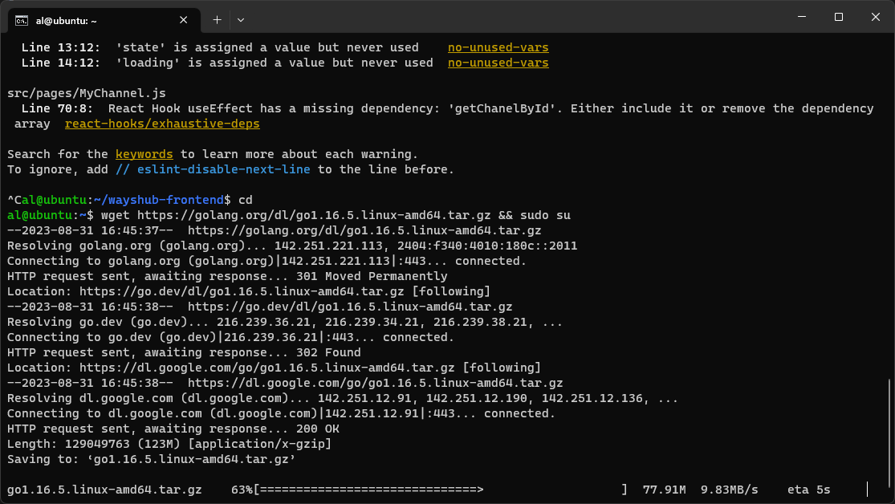
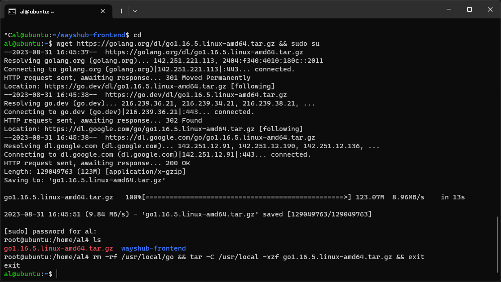
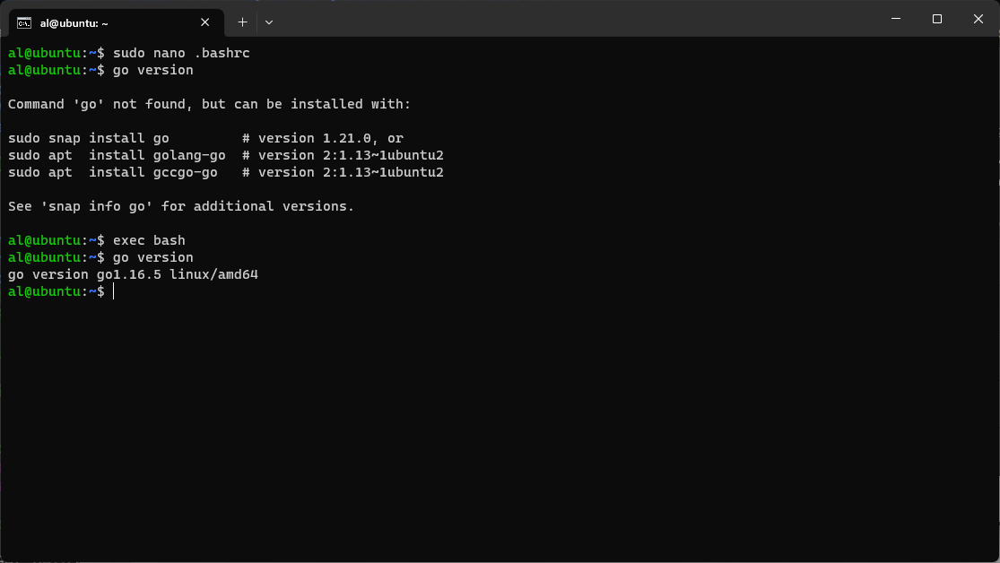
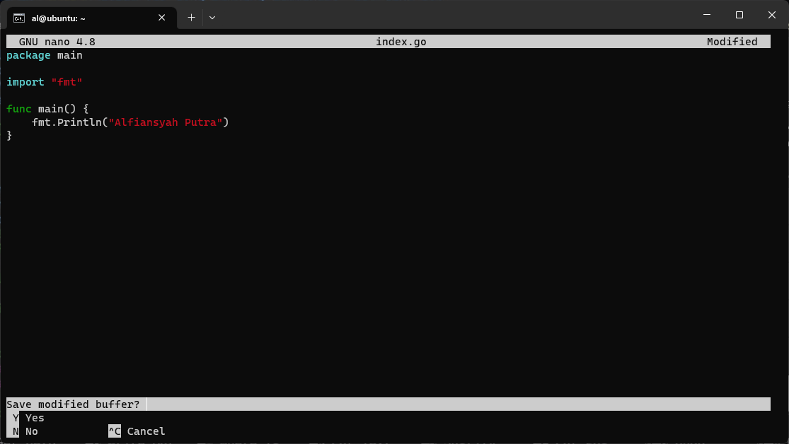
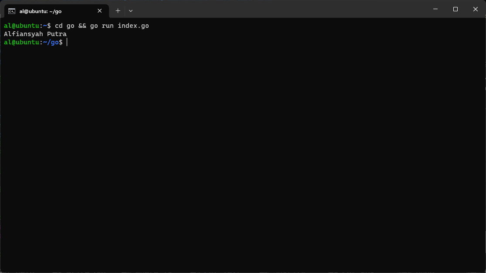
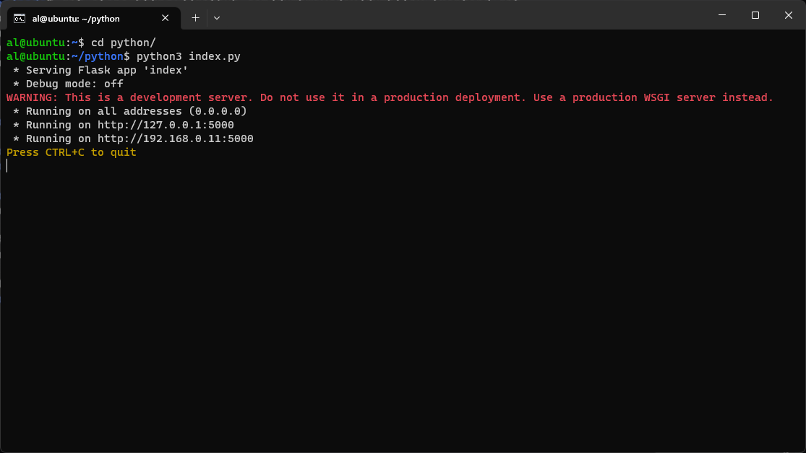

# Day 3 - Application in Server

## 1. Deploy Aplikasi wayshub-frontend (NodeJS)

1.	Login ke vm terlebih dahulu
```bash
ssh al@192.168.0.11
``` 

 
2.	Perbarui paket yang tersedia terlebih dahulu
```bash
sudo apt update
``` 


3.	Kemudian install Node Version Manager (NVM)
```bash
curl -o- https://raw.githubusercontent.com/nvm-sh/nvm/v0.39.3/install.sh | bash
``` 


4.	Lalu restart shell
```bash
exec bash
```

5.	Instal nvm versi 16
```bash
nvm install 16
```

 
6.	Cek versi node dan npm nya
```bash
node -v
```
```bash
npm -v
```

 
7.	Kemudian clone wayshub-frontend
```bash
git clone https://github.com/dumbwaysdev/wayshub-frontend.git
```

 
8.	Masuk ke folder wayshub-frontend dan instal dependensi nya
```bash
cd wayshub-frontend/
npm install
```

 
9.	Lalu jalankan aplikasinya
```bash
npm start
```

 
10.	Cek menggunakan web browser


 
## 2. Deploy Golang & Python dengan menampilkan nama masing-masing

1.	Instal golang terlebih dahulu dan switch user root
```bash
wget https://golang.org/dl/go1.16.5.linux-amd64.tar.gz && sudo su
```

 
2.	Hapus folder go dan extract file yang didownload tadi lalu keluar dari mode root
```bash
rm -rf /usr/local/go && tar -C /usr/local -xzf go1.16.5.linux-amd64.tar.gz && exit
```

 
3.	Tambahkan environment go pada bashrc
```bash
sudo nano .bashrc
```

 
4.	Masukan path go di bagian paling akhir
```bash
export PATH=$PATH:/usr/local/go/bin
```

 
5.	Lalu cek versi go
```bash
go version
```

 
6.	Buat folder go dan file index.go
```bash
mkdir go && nano go/index.go 
```


7.	Buat script print line

 
8.	Masuk ke folder go dan jalan kan index.go
```bash
cd go && go run index.go
```

 
9.	Cek versi python3 dan install pip
```bash
python3 –version
```

 
10.	Install package manager python3
```bash
sudo apt install python3-pip -y
```

 
11.	Lalu install flask
```bash
pip install flask
```

 
12.	Buat folder python dan index.py
```bash
mkdir python && python/index.py
```

13.	Lalu masukan script berikut dan save

 
14.	Masuk ke folder python dan jalan kan index.py
```bash
cd python/
python3 index.py
```

 
15.	Kemudian coba menggunakan browser

 
[**Back**](../../README.md)
