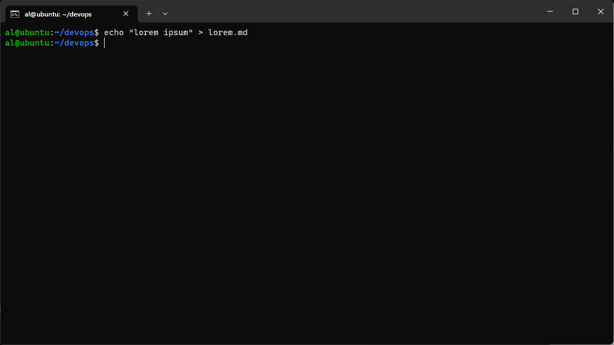
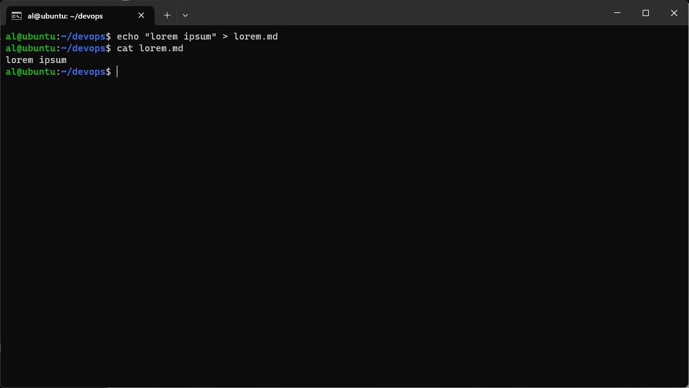
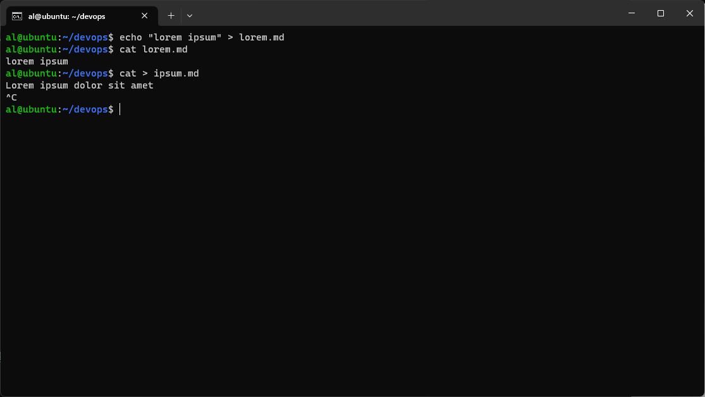
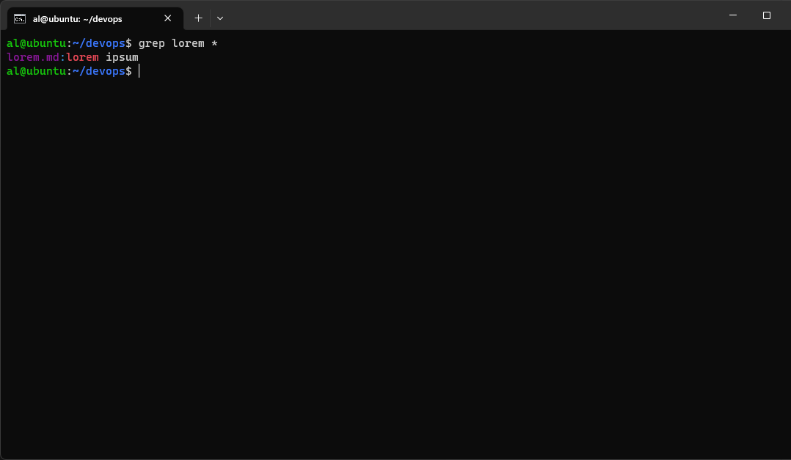
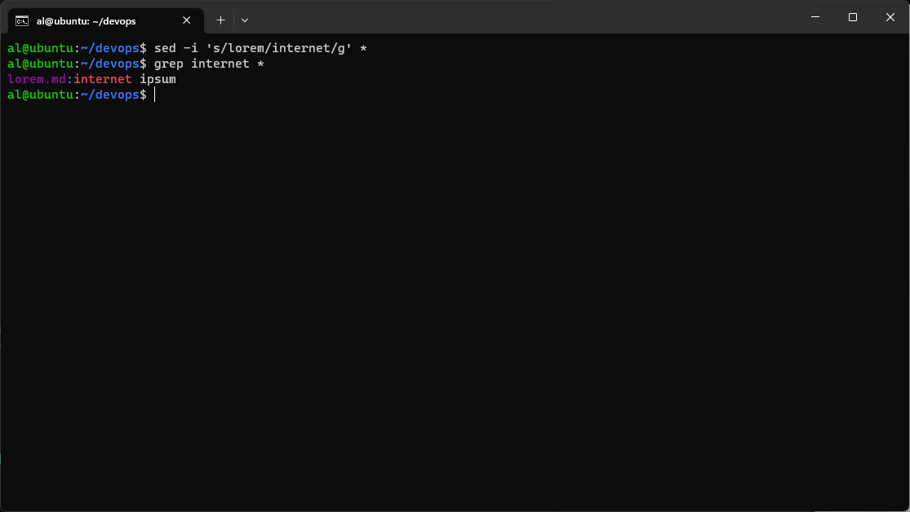
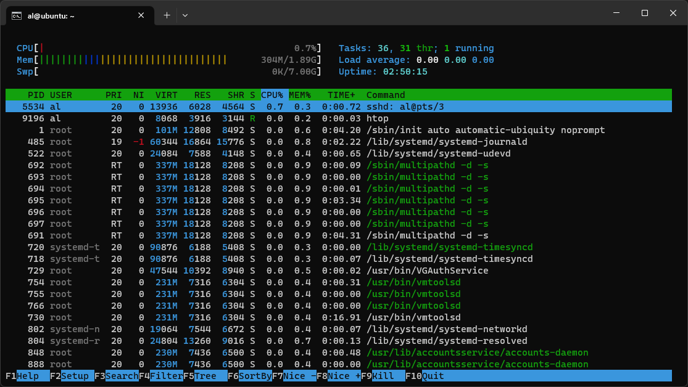
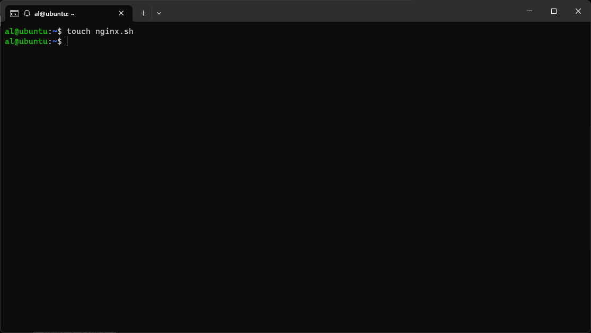
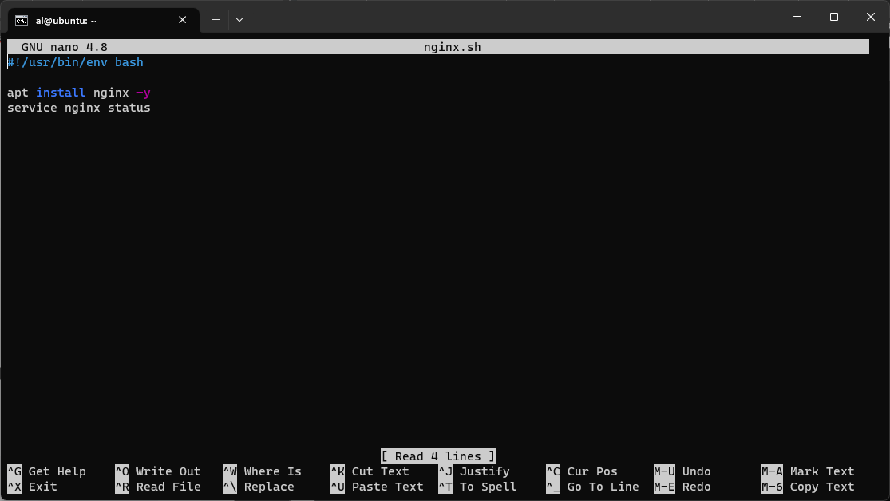
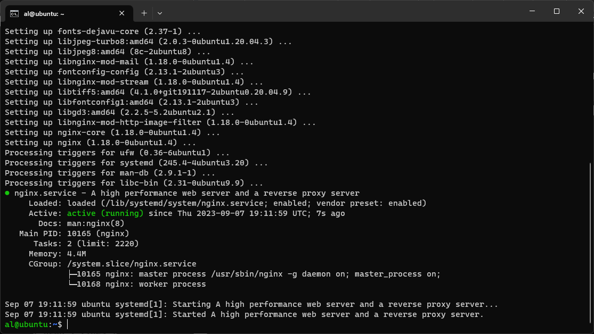

# Day 6 - Manage Server in Terminal

## 1. Text Manipulation

Adalah proses mengedit, mengubah, atau memanipulasi teks atau data langsung pada sebuah terminal atau tanpa text editor.

1. Membuat file menggunakan echo
```bash
echo "lorem ipsum" > lorem.md
``` 


2. Cara melihat isi file
```bash
cat lorem.md
``` 


3. Membuat file menggunakan cat
```bash
cat > ipsum.md
Lorem ipsum dolor sit amet  
``` 

kemudian setelah selesai menulis bisa close dengan ctrl+c


4. Mencari kata menggunakan grep
```bash
grep lorem *
``` 


5. Replace text dengan sed
```bash
sed -i 's/lorem/internet/g' *
``` 


## 2. htop 

1. Cara membuka htop
```bash
htop 
``` 


2. Cara membaca htop

Terlihat pada gambar diatas CPU yang digunakan sebesar 0.7%, Memory yang digunakan sebesar 304Mb dari 1.89Gb, dan swap 0kb dari 7Gb.
Lalu dari 36 task ada 1 task yang sedang bekerja.
Rata penggunaan 0% cpu, 0% memory dan 0% swap.
Server sudah berjalan selama 2jam 50menit

## 3. Create bash script to install nginx

1. buat file script nya terlebih dahulu
```bash
touch nginx.sh 
``` 


2. Lalu copy script berikut
```bash
#!/usr/bin/env bash

apt install nginx -y
service nginx status
``` 


2. Jalankan script bash nya menggunakan super user
```bash
sudo sh nginx.sh
```



[**Back**](../../README.md)
